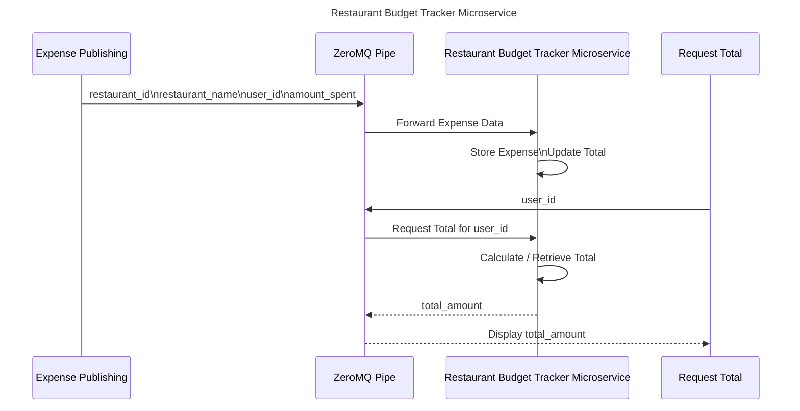

# restaurant_budget_tracker
A microservice that tracks restaurant spending based upon where you've eaten.

In order to send data:

1. Create and bind a ZMQ socket.
2. Send a JSON file that incorporates the following:
    - user_id
    - restaurant_id
    - restaurant_name
    - amount (amount spent)
An example call would be:
````
event = {
    "user_id": 1,
    "restaurant_id": 123123,
    "restaurant_name": "Happi House,
    "amount": 30.54
}

socket.send_string("expense_created " + json.dumps(event))
````

In order to request data:
1. Create and bind a ZMQ socket.
2. Request a specific user's total amount spent!
    Ex:
    ````
    socket.send_json({"user_id": 1})
    response = socket.recv_json()
    ````

